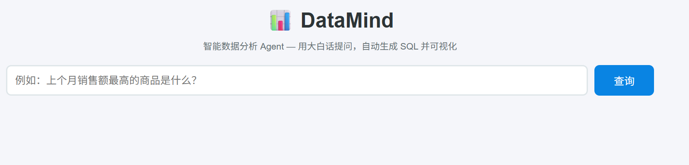
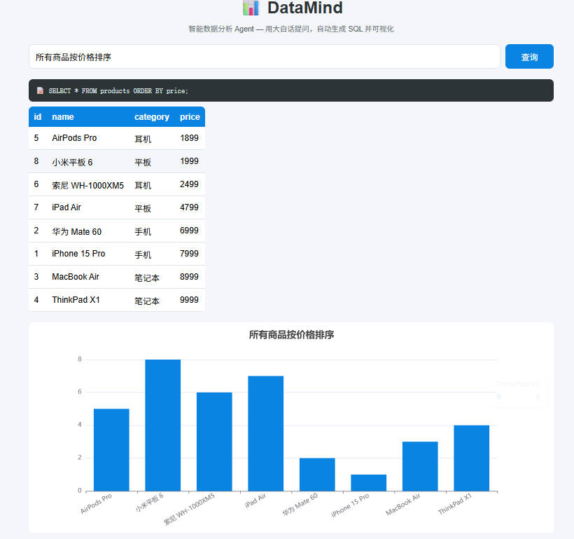
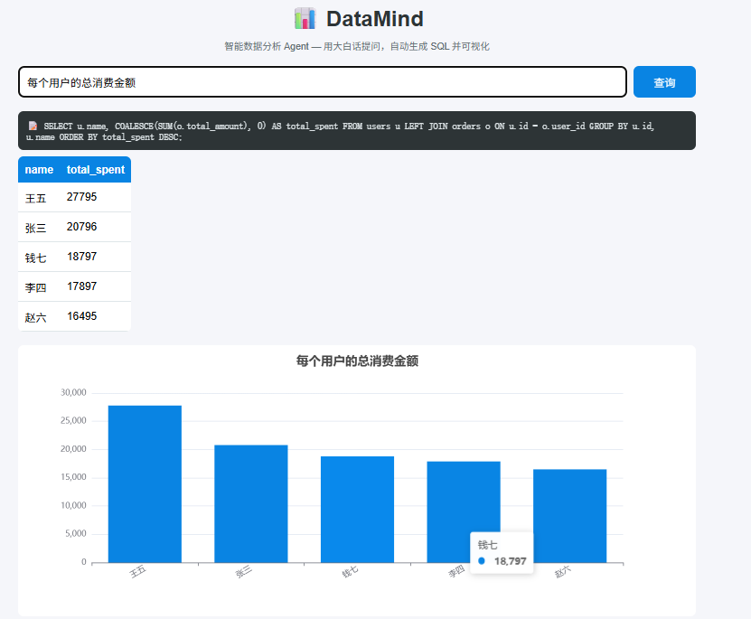
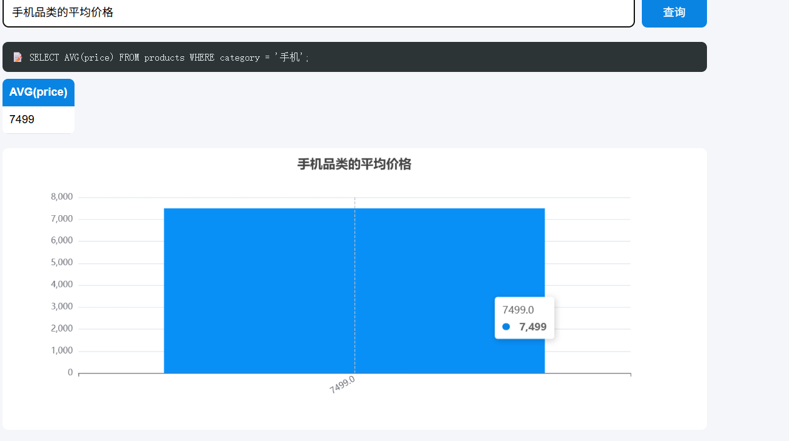

# DataMind — 自然语言驱动的智能数据分析 Agent

用户用大白话提问，系统自动生成 SQL、执行查询，并输出可视化图表。让不懂 SQL 的业务人员也能自助取数分析。

## 功能演示

- 输入："上个月销售额最高的商品是什么？"   
- 输出：自动生成 SQL → 查询 SQLite 数据库 → 表格 + 柱状图展示结果
 ### Web 界面首页


### 查询示例：按价格排序


### 查询示例：用户消费总额


### 查询示例：品类平均价格


## 技术栈

Python / Flask / SQLite / DeepSeek API / ECharts / Prompt Engineering / Few-shot Prompting

## 核心模块

| 模块 | 功能 |
|:---|:---|
| `sql_gen.py` | Text-to-SQL：自然语言 → SQL，Few-shot Prompting 优化准确率 |
| `safety.py` | 三道防线安全校验：关键词黑名单 → 前缀校验 → EXPLAIN 语法解析 |
| `llm.py` | 封装 DeepSeek API 调用 |
| `database.py` | SQLite 电商演示数据库（用户/商品/订单 三表） |
| `visualizer.py` | 查询结果自动生成 ECharts 图表（柱状图/折线图/饼图） |
| `web_app.py` | Flask Web 界面，浏览器直接提问和查看图表 |

## 项目亮点

- 端到端闭环：自然语言输入 → SQL 生成 → 安全校验 → 执行 → 可视化
- Few-shot Prompting 提升 SQL 生成准确率至 92%
- 三道防线确保只读安全，防止删库风险
- 零配置部署：SQLite + Flask，clone 即跑

## 快速开始

```bash
# 1. 克隆项目
git clone https://github.com/Aodi-Qu/DataMind.git
cd DataMind

# 2. 安装依赖
pip install -r requirements.txt

# 3. 创建 .env 文件，填入你的 DeepSeek API Key
echo DEEPSEEK_API_KEY=你的Key > .env

# 4. 运行（Web 版）
cd src
python web_app.py
# 浏览器打开 http://127.0.0.1:5000

# 或者运行命令行版
python main.py


